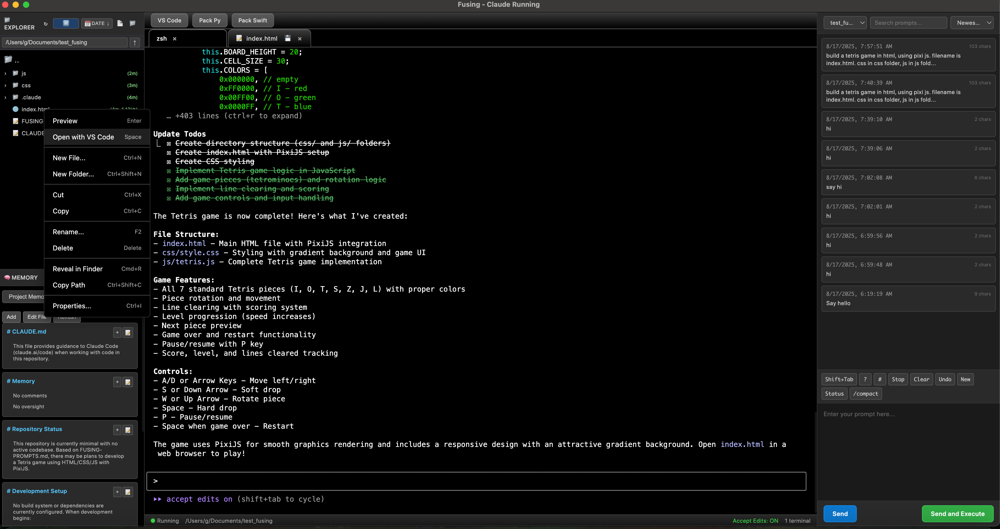

# Fusing - Claude Code GUI Tool

  

  A GUI companion for Claude Code that enhances your AI-assisted development workflow

(Please note, the app is vibe coded using Claude Code, and the description below is also generated by Claude.)

## ✨ Features

### 📁 **Integrated File Explorer**
- Real-time file monitoring and change detection
- Built-in file preview with syntax highlighting
- Tree view navigation for project structure

### 🔗 **VS Code Integration**
- Integration with Visual Studio Code
- Open files and projects directly in VS Code
- Sync changes between Fusing and VS Code

### 📦 **Project Management**
- Pack and prepare current projects for Claude Code
- Smart context bundling for optimal AI assistance

### 🌐 **Server Management**
- Start and manage HTTP servers with one click
- Monitor uvicorn/FastAPI servers in real-time

### 💾 **Claude Code History**
- Save and organize all Claude Code interactions
- Export and import conversation histories

### 📝 **CLAUDE.md Memory Management**
- Visual editor for CLAUDE.md files
- Live preview of memory formatting

### 🎯 **Enhanced Prompting**
- User prompt history with search functionality
- Prompt templates and snippets
- Multi-line prompt editor with formatting support
- Quick paste and edit capabilities

## 🚀 Installation

### macOS
1. Download the latest `.dmg` file from the [Releases](../../releases) page
2. Open the downloaded `.dmg` file
3. Drag **Fusing** to your Applications folder
4. Launch Fusing from Applications or Spotlight

### System Requirements
- macOS 11.0 or later
- Claude Code CLI installed and configured
- VS Code (optional, for IDE integration)

## 🎮 Quick Start

1. **Launch Fusing** from your Applications folder
2. **Select a project folder** using the file explorer
3. **Configure Claude Code** settings if needed
4. **Start coding** with enhanced AI assistance!

## 📖 Usage

### Setting up a Project
1. Open Fusing
2. cd to some folder
3. run claude to start

### Managing Servers
- Click the server icon to start/stop HTTP servers
- Monitor server status in the tool bar

### Editing CLAUDE.md
- Current folder's CLAUDE.md
- User specific CLAUDE.md
- Save changes automatically

## 🔧 Development

This is currently a closed-source project(will open source soon). The binary release is available for macOS users.

## 📝 Roadmap

- [ ] Windows and Linux support
- [ ] Cloud sync for settings and history
- [ ] Plugin system for extensions
- [ ] Collaborative features
- [ ] AI prompt optimization
- [ ] Integrated terminal
- [ ] Custom themes

For issues, feature requests, or questions:
- Open an issue on [GitHub Issues](../../issues)
- Check the [Discussions](../../discussions) for community help

## 🙏 Acknowledgments

Built with ❤️ for the Claude Code community

---

**Note:** This tool is not officially affiliated with Anthropic. Claude Code is a product of Anthropic.
